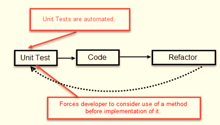
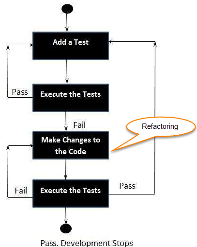

# Junit4 vs Junit5
JUnit 5, Java 8 kodlama stilini uyarlamayı ve JUnit 4'ten daha sağlam ve esnek olmayı amaçlamaktadır.

1- Bir test yöntemi bildirme açısından:
    
    Junit4: @Test
    Junit5: @Test

2- Geçerli sınıftaki tüm test yöntemlerinden önce yürütmek için
    
    Junit4: @BeforeClass   
    Junit5: @BeforeAll

3- Geçerli sınıftaki tüm test yöntemlerinden sonra yürütmek için
    
    Junit4: @AfterClass   
    Junit5: @AfterAll

4- Her bir test metodundan önce yürütmek için
    
    Junit4: @Before   
    Junit5: @BeforeEach

5- Her bir test metodundan sonra yürütmek için
    
    Junit4: @After   
    Junit5: @AfterEach

6- Bir metodu ya da sınıfı disable etmek için
    
    Junit4: @Ignore   
    Junit5: @Disabled

7- Tagleme ve filtreleme

    Junit4: @Category   
    Junit5: @Tag

8- Custom extension ekleme

     Junit4: Yok   
    Junit5: @ExtendWith

9- Assumptions

    Junit4:
    assumeFalse()
    assumeNoException()
    assumeNotNull()
    assumeThat()
    assumeTrue()

    Junit5
    assumeFalse()
    assumingThat​()
    assumeTrue()

10- Assertions

    AssertEquals'a ek olarak Junit5 assertThrows() ve assertAll() içerir.
---
# TDD

este Dayalı Geliştirme (TDD), kodun ne yapacağını belirlemek ve doğrulamak için test senaryolarının geliştirildiği yazılım geliştirme yaklaşımıdır. Basit bir ifadeyle, önce her bir işlevsellik için test senaryoları oluşturulur ve test edilir ve test başarısız olursa, testi geçmek ve kodu basit ve hatasız hale getirmek için yeni kod yazılır.

Test Odaklı Geliştirme, bir uygulamanın her küçük işlevi için testler tasarlamak ve geliştirmekle başlar. TDD çerçevesi, geliştiricilere yalnızca otomatik bir test başarısız olursa yeni kod yazma talimatı verir. Bu, kod tekrarını önler. TDD tam formu Test odaklı geliştirmedir.



TDD'nin basit konsepti, yeni kod yazmadan önce (geliştirmeden önce) başarısız olan testleri yazmak ve düzeltmektir. Bu, testleri geçmek için bir seferde az miktarda kod yazdığımız için kodun tekrarlanmasını önlemeye yardımcı olur. (Testler, bunları yerine getirmek için test etmemiz gereken gereksinim koşullarından başka bir şey değildir).

Test Odaklı geliştirme, uygulamanın fiili olarak geliştirilmesinden önce otomatik test geliştirme ve çalıştırma sürecidir. Bu nedenle, TDD bazen Test İlk Geliştirme olarak da adlandırılır.


## TDD döngüsü 

1. Bir test yaz
2. Çalıştırın.
3. Doğru yapmak için kodu değiştirin, yani Refactor.
4. İşlemi tekrarlayın.

---
# Mocking

Birim testleri küçük testler (atomik), hafif ve hızlı olmalıdır. Ancak, test edilen bir nesnenin diğer nesnelere bağımlılıkları olabilir. Bir veritabanıyla etkileşime girmesi, bir posta sunucusuyla iletişim kurması veya bir web hizmetiyle veya bir mesaj kuyruğuyla konuşması gerekebilir. Tüm bu hizmetler, birim testi sırasında kullanılamayabilir. Mevcut olsalar bile, test edilen nesneyi bağımlılıklarıyla birlikte test eden birim, kabul edilemez miktarda zaman alabilir.
. Birim testte amaç, test edilen nesnenin aslında ortak çalışanı kullandığını düşünmesini sağlamak için ortak çalışanı taklit etmektir.
Test senaryosu için bir ürün sipariş hizmeti düşünün. Bir müşteri, bir ürün sipariş sürecini gerçekleştirmek için bir DAO ile etkileşime girer
Product.java
```java
package guru.springframework.unittest.mockito;
public class Product {
}
```
ProductDao.java
```java
package guru.springframework.unittest.mockito;
public interface ProductDao {
  int getAvailableProducts(Product product);
  int orderProduct(Product product, int orderedQuantity);
}
```

ProductService.java
```java
package guru.springframework.unittest.mockito;
public class ProductService {
  private ProductDao productDao;
  public void setProductDao(ProductDao productDao) {
    this.productDao = productDao;
  }
  public boolean buy(Product product, int orderedQuantity) throws InsufficientProductsException {
    boolean transactionStatus=false;
    int availableQuantity = productDao.getAvailableProducts(product);
    if (orderedQuantity > availableQuantity) {
      throw new InsufficientProductsException();
    }
    productDao.orderProduct(product, orderedQuantity);
    transactionStatus=true;
    return transactionStatus;
  }
}
```
MockTest
```java
package guru.springframework.unittest.mockito;
import org.junit.Before;
import org.junit.Test;
import static org.junit.Assert.*;
import org.mockito.Mock;
import org.mockito.MockitoAnnotations;
public class MockCreationAnnotationTest {
    @Mock
    private ProductDao productDao;
    @Mock
    private Product product;
    @Before
    public void setupMock() {
       MockitoAnnotations.initMocks(this);
    }
    @Test
    public void testMockCreation(){
        assertNotNull(product);
        assertNotNull(productDao);
    }
}

```
Stubbing
```java
. . .
@Test
public void testBuy() throws InsufficientProductsException {
    when(productDao.getAvailableProducts(product)).thenReturn(30);
    assertEquals(30,productDao.getAvailableProducts(product));
}
. . .
```

Verifying 
```java
. . .
@Test
public void testBuy() throws InsufficientProductsException {
    when(productDao.getAvailableProducts(product)).thenReturn(30);
    assertEquals(30,productDao.getAvailableProducts(product));
    productService.buy(product, 5);
    verify(productDao).orderProduct(product, 5);
}
. . .
```

---

# Spring Profile 

Geliştirme, test, prod gibi farklı profilleri kullanmamızı sağlar. 

Basitten başlayalım ve bir beani nasıl belirli bir profile ait hale getirebileceğimize bakalım. @Profile ek açıklamasını kullanıyoruz - çekirdeği o belirli profille eşleştiriyoruz; açıklama sadece bir (veya birden çok) profilin adını alır.

Temel bir senaryo düşünün: Yalnızca geliştirme sırasında etkin olması gereken ancak üretimde kullanılmayan bir bean var.

Bu bean geliştirici profiliyle açıklama ekleriz ve yalnızca geliştirme sırasında kapsayıcıda bulunur. Canlıda, geliştirici aktif olmayacak:

```java
@Component
@Profile("dev")
public class DevDatasourceConfig
```
